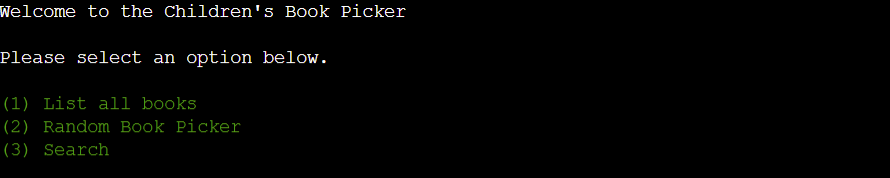

# The Children's Book Picker

The Children's Book Picker is a command-line interface (CLI) data automation program that runs on a mock terminal in Heroku. The program is designed to assist parents, teachers, and family members in selecting appropriate reading books for children. This program is developed to demonstrate competency in python programming and is purely for educational purposes.

View the live site [here](https://the-childrens-book-picker-024245f82ca0.herokuapp.com/).

------
# Table of Content

- [The Children's Book Picker](#the-childrens-book-picker)
- [Table of Content](#table-of-content)
  - [User Experience (UX)](#user-experience-ux)
    - [Site Purpose](#site-purpose)
      - [Are you struggling to find high-quality children's books to read to your little ones?](#are-you-struggling-to-find-high-quality-childrens-books-to-read-to-your-little-ones)
    - [Site Goals:](#site-goals)
    - [Audience:](#audience)
    - [Communication:](#communication)
    - [Current User Goals:](#current-user-goals)
    - [New User Goals:](#new-user-goals)
    - [**Future Goals:**](#future-goals)
  - [Design](#design)
    - [Wireframe:](#wireframe)
  - [Features](#features)
    - [Existing Features:](#existing-features)
    - [Landing Page:](#landing-page)
    - [List all Books](#list-all-books)
    - [The Random Book Picker](#the-random-book-picker)
    - [Search](#search)
    - [**Features Left to Implement**](#features-left-to-implement)
  - [Testing](#testing)
    - [Validator Testing](#validator-testing)
    - [Manual Testing](#manual-testing)
    - [Unfixed Bugs](#unfixed-bugs)
  - [Technologies Used](#technologies-used)
    - [Main Languages Used](#main-languages-used)
  - [Deployment and Development](#deployment-and-development)
    - [Deploying the App](#deploying-the-app)
    - [Forking The Repository](#forking-the-repository)
    - [Cloning The Repository](#cloning-the-repository)
  - [Credits](#credits)
  - [Acknowledgements](#acknowledgements)
------

## User Experience (UX)

### Site Purpose

#### Are you struggling to find high-quality children's books to read to your little ones? 

Look no further than The Children's Book Picker app! This app provides a list of the best English children's books, based on recommendations from BookTrust, the largest children's reading charity in the UK. You can trust that you're providing your child with the best English literature available. The app allows you to view complete book lists, choose a random book from an age category, or search for a book by title or author.

### Site Goals:

The goal is to organize the curated children's literature list from BookTrust in a more accessible manner for users.

### Audience:

This refers to anyone who is interested in developing literature for children and teenagers.

### Communication:

The app communicates its intent through print statements, which prompt the user to select options from those available. Available options are presented in green text, while error messages and the option to exit the program are presented in red text.

### Current User Goals:

To keep the user engaged with the app, provide them with a variety of choices and the ability to restart the application for ease of use if they wish to explore alternative features.

### New User Goals:

For quick, relevant book recommendations and an easy-to-navigate app, try our service.

### **Future Goals:**

- Adding a synopsis of a randomly selected book or search feature. The synopsis would provide a brief summary of the book's plot, characters, and themes, allowing readers to quickly determine if the book is of interest to them. This feature can be useful for online bookstores, libraries, and book clubs, as it can help users discover new books and make informed choices about what to read next.
- Adding a five-star user book review feature.

------

## Design

### Wireframe:

------

## Features

### Existing Features:

### Landing Page:

- All text highlighted in green indicates user options on any given page.
- All text marked in red indicates either an error message to the user for incorrect input, or the option to exit the program.

### List all Books

### The Random Book Picker

### Search

### **Features Left to Implement**

- Adding a synopsis of a randomly selected book or search feature.
- Adding a five-star user book review feature.

------

## Testing

I conducted multiple tests for this project.

Note: The Code Institute template (https://github.com/Code-Institute-Org/python-essentials-template) already included HTML, CSS, and JavaScript, so we did not need to include them within the scope of this project. Furthermore, we did not consider responsive design.

### Validator Testing

The code has been tested by using [Code Institute CI Python Linter (Pep8)](https://pep8ci.herokuapp.com/)

### Manual Testing

Run each test mentioned in the table below multiple times.

| TEST                                                      | ACTION                                                       | EXPECTATION                                   | RESULT            |
| --------------------------------------------------------- | ------------------------------------------------------------ | --------------------------------------------- | ----------------- |
| Accessing option one “List All Books”                     | Input 1 + enter                                              | Display complete book list.                   | Expectation meet. |
| Returning from “List All Books” page to main menu         | Input 0 + enter                                              | Returned to main menu                         | Expectation meet. |
| Quit program on “List All Books” page.                    | Input x + enter                                              | Quits program                                 | Expectation meet. |
| Accessing option two “The Random Book Picker”             | Input 2 + enter                                              | Displays developmental reading categories.    | Expectation meet. |
| Selects developmental reading category                    | Inputted different numbers between one and five to test all categories. | Display selected book results                 | Expectation meet. |
| Return to main menu for “The Random Book Picker ” result. | Input 0 + enter                                              | Display the main menu on the welcome page     | Expectation meet. |
| Quit program on “The Random Book Picker” results page.    | Input x + enter                                              | Quits program                                 | Expectation meet. |
| Selects “Search” feature                                  | Input 3  + enter                                             | Display “Type your search term below” message | Expectation meet. |
| Search term entered                                       | Input book title or author                                   | Display search results                        | Expectation meet. |
| Return to main menu from search result.                   | Input 0 + enter                                              | Display the main menu on the welcome page     | Expectation meet. |
| Quit program on search results page.                      | Input x + enter                                              | Quits program                                 | Expectation meet. |
| Display error message                                     | Incorrect input                                              | Display error message with feedback to user.  | Expectation meet. |

### Unfixed Bugs

No consistent bugs were found during manual testing.

------

## Technologies Used

### Main Languages Used

- Python

**Frameworks, Libraries & Programs Used**

- [**Code Institute Template**](https://github.com/Code-Institute-Org/python-essentials-template) - Already included HTML, CSS and JavaScript.
- [**Google Sheets](https://www.google.co.uk/sheets/about/)** - This is where application data is stored.
- [**Heroku](https://www.heroku.com/)** - Heroku is a cloud platform that allows developers to build, deploy, and manage applications.
- [**import os**](https://docs.python.org/3/library/os.html) - This Python module provides a way to interact with the operating system and to clear the terminal.
- [**import random**](https://docs.python.org/3/library/random.html) - The `random` module provides functions for generating random numbers or selecting random items from a list
- [**import sys**](https://docs.python.org/3/library/sys.html) - Is a Python statement that allows the program to interact with the interpreter
- [**from\* termcolor \*import\* colored**](https://pypi.org/project/termcolor/) - A Python statement that imports the `colored` function from the `termcolor` module
- [**Code Anywhere**](https://codeanywhere.com/solutions/collaborate) - Secondary coding IDE.
- [**Code Institute's CI Python Linter**](https://pep8ci.herokuapp.com/) - A Python linter is a tool that checks Python code for errors and potential problems, such as syntax errors, unused variables, and inconsistent indentation.
- **[Github](https://www.google.com/search?q=github&rlz=1C1JZAP_enNL891NL891&oq=github&aqs=chrome..69i57j69i59l3j69i60l4.700917207j0j15&sourceid=chrome&ie=UTF-8#:~:text=GitHub%3A Let's build from here · GitHub)** - Used to host the repository
- **[Lucidchart](https://www.lucidchart.com/pages/)** - Used to create a flowchart during the planning stage.
- **[Notion AI](https://www.notion.so/product/ai)** - Use this tool as a spelling and grammar checker, as well as a research aid.
- [**Python**](https://www.python.org/) - Used to provide functionality to the site
- [**Visual Studios Code (VS Code)](https://code.visualstudio.com/)** - Primary coding IDE.

------

## Deployment and Development

- The project was developed using Visual Studios Code (VS Code) to create the code and files required.
- The project files, code, and information are hosted by [Github](https://github.com/).

### Deploying the App

The deployment of the project was done using [Heroku](https://www.heroku.com/) through the following steps.

1. Log in to Heroku or create an account if necessary.
2. Click on the button labeled "New" from the dashboard in the top right corner and select the "Create new app" option in the drop-down menu.
3. Enter a unique name for the application and select the region you are in.
   - For this project, the unique name is "the-childrens-book-picker" and the region selected is Europe.
4. Click on "create app".
5. Navigate to the settings tab and locate the "Config Vars" section and click "Reveal config vars".
6. Add a config var (if the project uses creds.json file.)
   - In the "KEY" field:
     - enter "CREDS" in capital letters.
   - In the "VALUE" field:
     - copy and paste the contents of your creds.json file and click "Add".
7. Add another config var.
   - In the "KEY" field:
     - enter PORT in all capital letters.
   - In the "VALUE" field:
     - enter 8000 and click "Add".
8. Scroll to the "Buildpacks" section and click "Add buildpack".
9. Select Python and save changes.
10. Add another buildpack and select Nodejs then save changes again.
11. Ensure that the python buildpack is above the Nodejs buildpack.
12. Navigate to the "Deploy" section by clicking the "Deploy" tab in the top navbar.
13. Select "GitHub" as the deployment method and click "Connect to GitHub".
14. Search for the GitHub repository name in the search bar.
15. Click on "connect" to link the repository to Heroku.
16. Scroll down and click on "Deploy Branch".
17. Once the app is deployed, Heroku will notify you and provide a button to view the app.

Important: If you want the deployed app to automatically rebuild every time you push to GitHub, you can click on "Enable".

### Forking The Repository

This can be done to create a copy of the repository. The copy can be viewed and edited without affecting the original repository.

To fork the repository through GitHub, take the following steps:

1. In the "Project-3-The-Children-s-Book-Picker" repository, click on the "fork" tab in the top right corner.
2. Click on "create fork" to fork the repository.

### Cloning The Repository

To clone the repository through GitHub:

1. In the repository, select the "code" tab located just above the list of files and next to the GitHub button.
2. Ensure HTTPS is selected in the dropdown menu.
3. Copy the URL under HTTPS.
4. Open Git Bash in your IDE of choice.
5. Change the current working directory to the location where you want the cloned directory to be created.
6. Type "git clone" and paste the URL that was copied from the repository.
7. Press the "enter" key to create the clone.

------

## Credits

- Tony118g is the developer who created the "clear_tmnl" function in the "doctor-dairy" project. This function was originally mentioned in a Slack post by Matt Rudge.

  https://github.com/Tony118g/doctor-diary#credits

- The Love-Sandwiches tutorials from [Code Institute](https://learn.codeinstitute.net/courses/course-v1:CodeInstitute+LS101+2021_T1/courseware/293ee9d8ff3542d3b877137ed81b9a5b/58d3e90f9a2043908c62f31e51c15deb/) helped me create the import libraries and packages section in my code, as well as deploy my app on Heroku.

- Andreas-ka and Bigfoot-rage helped write the deployment section of this app's README.

  https://github.com/andreas-ka/bigfoot-rage#deployment

- **Lauren-Nicole** (Code Institute - Mentor) provided instrumental advice and feedback during the development of this app.

- **Henk Kroese**, a close personal friend, for helping me better understand how programming logic.

- The following project is from fellow students who are helping me create my app:

  - [**CluelessBiker**](https://github.com/CluelessBiker/project3-layer-cakes/blob/main/README.md#frameworks-libraries--programs-used) - project3-layer-cakes
  - [**Tony118g**](https://github.com/Tony118g/doctor-diary/blob/main/README.md#technologies-used) - doctor-dairy
  - [**Pelikantapeten**](https://github.com/Pelikantapeten/p3-dad-jokes/blob/main/README.md#testing) - p3-dad-jokes
  - **[andreas-ka](https://github.com/andreas-ka/bigfoot-rage#deployment)** - bigfoot-rage: Helping to write the deployment section in this [README.md](http://README.md).

------

## Acknowledgements

This site was developed as a third portfolio project for the Code Institute course in Full Stack Software Development. I would like to thank the following for all of the support throughout the development phase.

- The Code Institute community, including fellow students and staff.
- The Code Institute tutor team.

Johann Jurgens Blignaut 2023

*"Omnis gloria Deo"*

